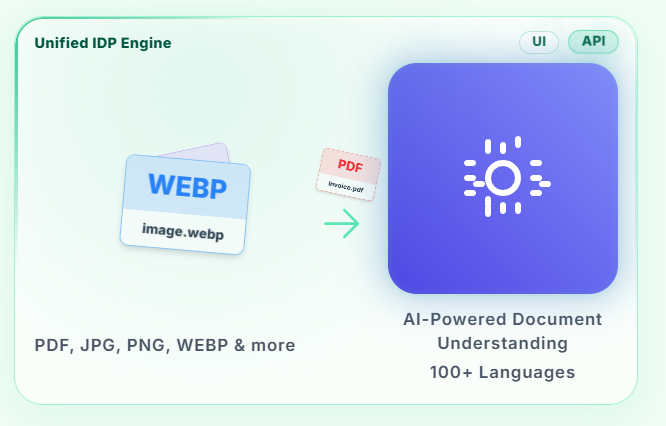
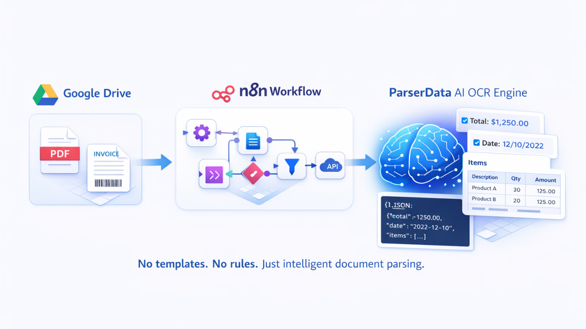

  

# ParserData

**Intelligent Document Processing for Financial Data**

ParserData is a platform that turns financial documents into clean, structured datasets that can be directly used by analytics systems, databases, and business workflows.

Customers upload or stream documents such as reports, statements, and invoices, and ParserData automatically extracts, normalizes, and validates the data into a consistent schema.

---

## What ParserData Does

ParserData handles the full document processing pipeline:

- **Ingestion**  
  Upload files via UI or stream documents through an [API](https://parserdata.com/parserdata-api)

- **Document Understanding**  
  Identify document structure, tables, and relevant fields

- **Extraction**  
  Capture structured data from invoices, receipts, statements, and reports

- **Normalization & Validation**  
  Normalize values, validate formats, and enforce consistent schemas

- **Delivery**  
  Deliver clean structured outputs via API or export

Supported output formats include **JSON, Excel, CSV, and XML**.

---

## Designed for Reliability at Scale

ParserData is built for teams that currently rely on:

- Manual data preparation
- Spreadsheet-based workflows
- Fragile custom scripts
- One-off document parsing logic

Instead, ParserData provides a **reliable, scalable, and schema-driven** way to convert financial documents into usable data that downstream systems can trust.

---

## Common Use Cases

- Invoice and receipt processing
- Bank and financial statement extraction
- Financial reporting automation
- Feeding data into analytics or BI systems
- ETL pipelines for accounting and finance teams
- Workflow automation via APIs and integrations

---

## API-First Platform

ParserData is designed to integrate easily into modern systems:

- REST API for document ingestion and extraction
- Schema-based extraction for predictable outputs
- Automation-friendly for tools like Python, n8n, Make, and custom pipelines
- Suitable for batch and streaming workflows

Example repositories with cURL, Python, and automation workflows are pinned below.

---

## 🛠️ Technologies and Stack

   &nbsp;
   &nbsp;
   &nbsp;
   &nbsp;
   &nbsp;
   &nbsp;
   &nbsp;
   &nbsp;
   &nbsp;
  

---

## Who It’s For

ParserData is built for:

- Finance and accounting teams
- Data and analytics teams
- Engineering teams supporting financial workflows
- Companies processing large volumes of financial documents

If your workflows depend on clean, structured financial data, ParserData removes the manual work required to get there.

---

## Philosophy

ParserData focuses on **clarity, consistency, and correctness**.

The goal is not just to extract text, but to deliver **usable, validated data** that fits directly into real-world financial systems and workflows.

---

## 🌍 Connect with ParserData

&nbsp;&nbsp;

&nbsp;&nbsp;

&nbsp;&nbsp;

